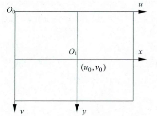
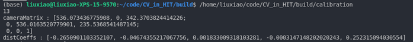
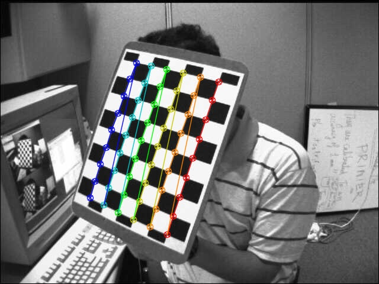
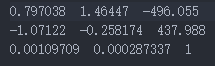

# CV_in_HIT
The homework for Computer Vision in Harbin Institute of Technology SZ

## Coordinates
本作业建立坐标系如下图  
  

## Requirement
Opencv 3.4.X

## File
| File                      | Description                                                       |
| ------------------------- | ----------------------------------------------------------------- |
| calibration               | Use Opencv to calibrate a camera                                  |
| filter                    | Source code about Mean filter, Meadian filter and Gaussian filter |
| homography                | Detect chess board and calculate homography matrix                |
| optical flow              | Calculate Lucas-Knanade optical flow                              |
| Photometric Stereo Method | Use Photometric Stereo Method to rebuild a surface                |
| skin_detection            | Use color Space to detect skin in pictures                        |

## Result
### Calibration

### Filter

### Homography

    

### Optical Flow

    

### Photometric Stereo Method

### Skin Detection

    

